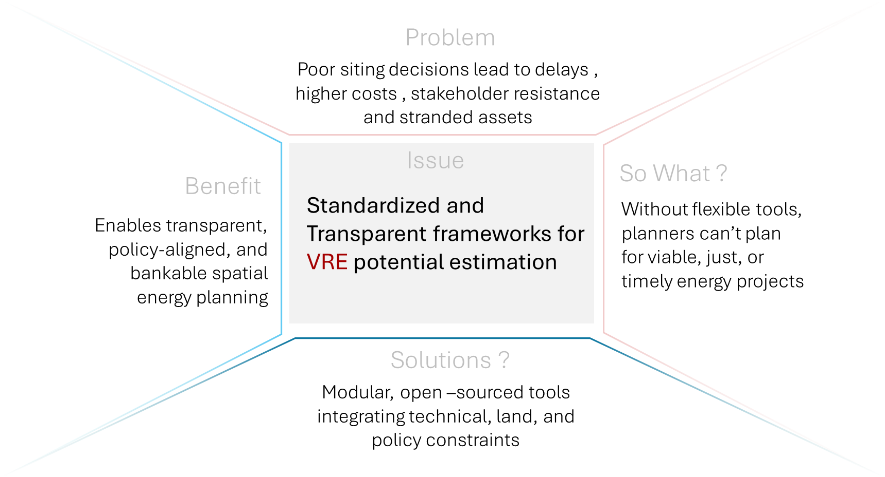
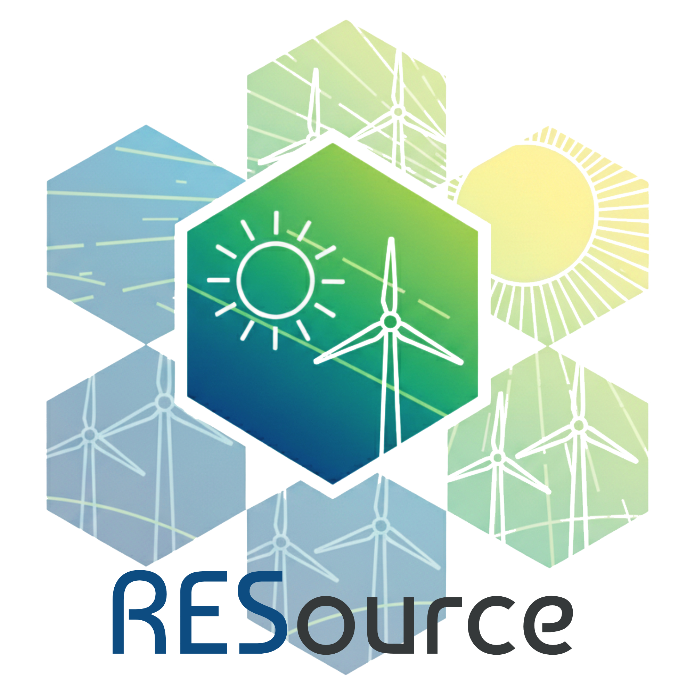
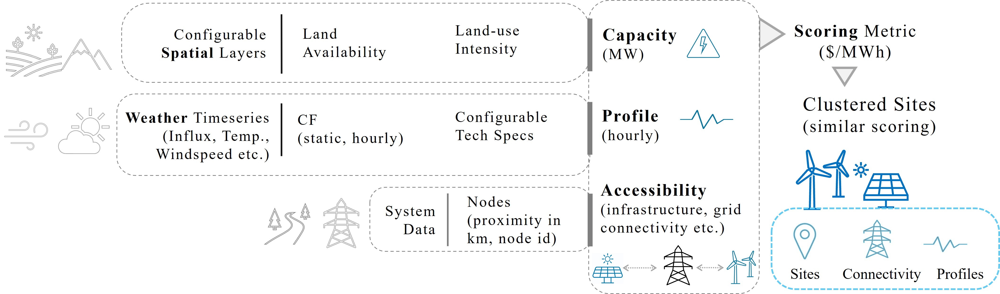

__One of the many solutions ?__

__A Modular and Transparent Open-Source Framework for Sub-National Assessment of Solar and Land-based Wind Potential.__

> ⚠️ **Note: This library is under heavy development**

RESource is developed to enable reproducible, adaptable assessments of VRE potential that are sensitive to local constraints and planning priorities. We developed a structured, modular workflow that integrates geospatial, temporal, economic, and regulatory data to evaluate site suitability for solar and wind energy development. This structured methodology ensures transparency and transferability, allowing RESource to be adapted for different regions and scaled for long-term strategic energy planning.

## Workflow overview

## 🚀 Quick Start

**New to RESource?** Get started with 

📖 **[Full Quickstart Guide](https://deltae.github.io/RESource/#quick-start))** | 📚 **[Complete Documentation](https://deltae.github.io/RESource/)**

------

## 📋 Key Features

- **🌍 Multi-Regional**: Canada, Western Balkans, and custom regions
- **⚡ Multi-Technology**: Wind and solar resource assessment
- **🔧 Modular Design**: Configurable exclusions, constraints, and parameters
- **📊 Rich Outputs**: Time series, capacity maps, and interactive visualizations
- **🔄 Reproducible**: Locked environments and standardized workflows

------

## 📚 Resources

- **[📖 Quickstart Guide](QUICKSTART.md)** - Get running in 5 minutes
- **[🏔️ BC Case Study](https://deltae.github.io/RESource/notes/case_BC.html)** - Detailed regional analysis
- **[📘 Full Documentation](https://deltae.github.io/RESource/)** - Complete reference
- **[💻 Setup Guide](https://deltae.github.io/RESource/notes/setup_guide.html)** - Environment and development setup
