```{warning}
This library is under heavy development
```

# Case study: VRE site selection in British Columbia
For more on this case study, please refer to the open-access publication [here](https://www.example.com).

To demonstrate RESource's practical utility, we apply the framework to the Canadian province of British Columbia (BC). BC presents an ideal testbed due to its varied geography—coastal areas, rugged mountains, and interior plateaus—and a favorable policy environment, including the [Clean Energy Act](https://www.bclaws.gov.bc.ca/civix/document/id/complete/statreg/10022_01), [expedited permitting processes for wind projects](https://news.gov.bc.ca/releases/2025ECS0006-000100) and renewable energy targeted call for power [2024](https://www.bchydro.com/work-with-us/selling-clean-energy/2024-call-for-power.html), [2025](https://www.bchydro.com/work-with-us/selling-clean-energy/2025-call-for-power.html) by BC Hydro. These characteristics offer a rich context for testing spatial, technical, and regulatory dimensions of VRE siting.

## Data sources
The RESource framework integrates multiple data sources to characterize VRE potential in BC:
Here is a quick overview of the data sources used in this case study:

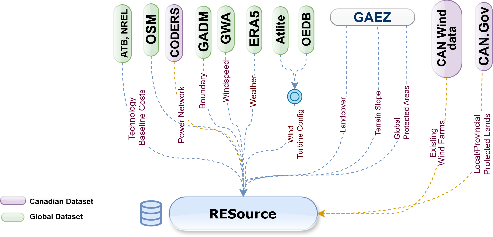

```{seealso}
[Detailed overview of the data sources used in this case study.](https://deltae.github.io/RESource/notes/data.html)
```

## Extracting Spatial grid cells
BC was discretized into uniform grid cells using the spatial resolution of ERA5 data (~30 km × 30 km), with each cell serving as the basic unit of analysis. For each cell, RESource processed multiple geospatial layers, filtering out ineligible land based on legal (e.g., protected areas), environmental (e.g., slope, wetlands), and infrastructure-related constraints (e.g., distance to substations). Eligible cells were then evaluated for their proximity to the grid and assigned hourly profiles of solar irradiance and wind speed, allowing theoretical VRE potential to be estimated per technology.
 
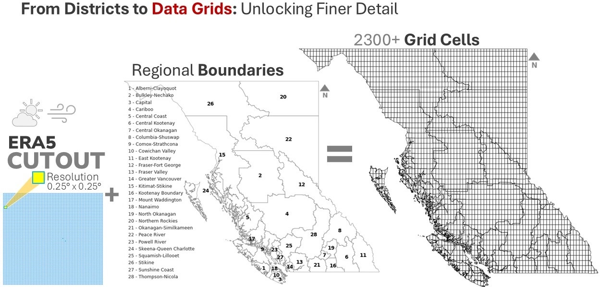

## Spatial Screening and Land Availability
Key parameters are configurable to reflect geographic constraints (e.g., slope, protected areas), We applied the spatial screening process using global raster datasets from the GAEZ to systematically identify suitable VRE sites by filtering land based on land cover, terrain slope, and exclusion zones.. Land cover data layers are used to selectively include classes such as croplands, grasslands, shrubs, and bare soil while excluding artificial surfaces, dense forests, and water bodies. Terrain slope rasters helped eliminate areas with steep gradients over 30%, which pose construction and accessibility challenges. Additionally, exclusion zones—compiled from global biodiversity, wetland, and protected area databases—were entirely filtered out from consideration to respect environmental conservation boundaries. This layered geospatial filtering ensures that selected sites align with both technical feasibility and ecological integrity. We extracted the land availability map from this spatial screening process. 

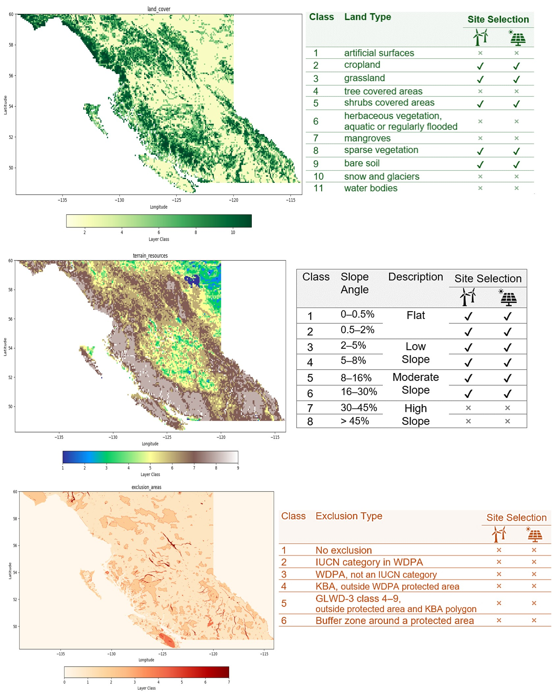


> For full details on the raster classes, refer to the [Global Agro-Ecological Zones v4 – Model documentation](https://openknowledge.fao.org/items/039f7ec9-98af-49e1-8d24-850122c69bef).

```{tip}
|chapter 2|
page 17; Elevation and terrain-slope data 
page 18; Land Cover data
page 20; Exclusion zones
```


Spatial screening revealed that roughly 64% of BC’s land is unsuitable for VRE development due to terrain, regulatory restrictions, and conservation priorities. The remaining land comprises technically viable areas suitable for further capacity and cost assessment. Figure 5 illustrates the land availability for grid cells (in the left most plot) and the potential capacity translated from availability percentage. It illustrates that steep terrain in the province’s western region limits turbine deployment, while the southern interior exhibits favorable solar deployment. Regulatory buffers around aeroways and parks further shape siting decisions.

- Resource's spatial screening process for BC, showing the stepwise filtering of land availability based on terrain, land cover, and exclusion zones. These plots are in 100m resolution, illustrating the progressive reduction of eligible land as each layer of constraints is applied.


  - The land availability maps for BC, illustrating the __remaining eligible areas after applying each layer of spatial constraints__.
  
    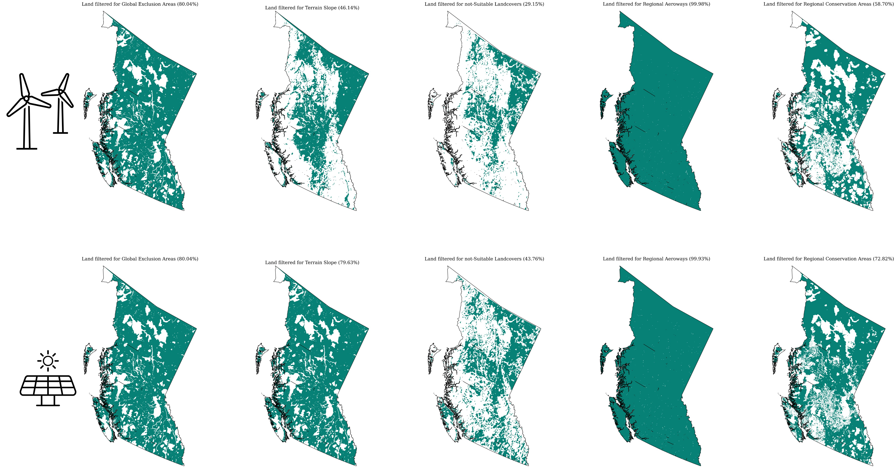

  - The __cumulative impact of each layer__ on land availability, illustrating how terrain, land cover, and exclusion zones progressively reduce the pool of eligible sites.
  
    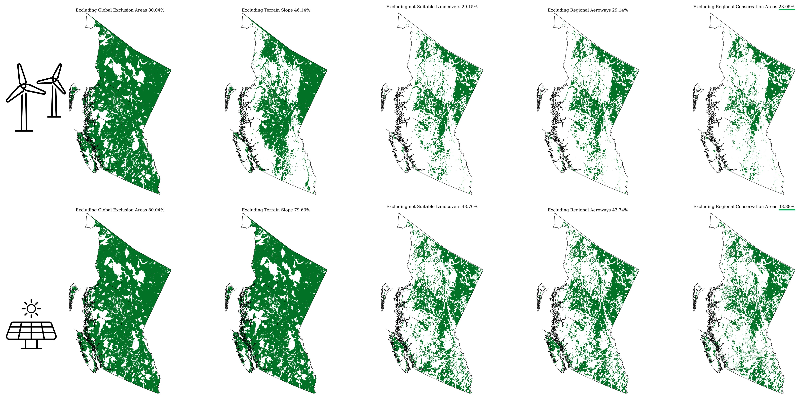


  - __Rescaling the land availability map to the ERA5 grid resolution__.
  
    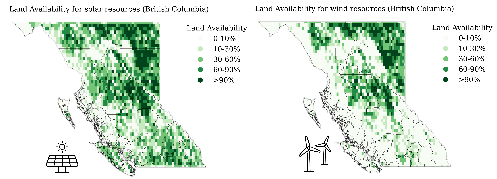

  > The rescaled land availability map for BC, showing the eligible areas aligned with the ERA5 grid resolution. This step ensures that the spatial data is compatible with the weather-driven modeling inputs used in subsequent analyses.

## Potential capacity
We translated eligible land into theoretical energy capacity using technology-specific land-use intensity benchmarks—3 MW/km² for wind and 1.45 MW/km² for solar PV consistent with prior studies [[5](#5),[6](#6),[7](#7)].

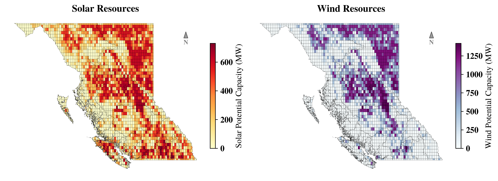

## Capacity factor
While the potential capacity map highlights the total installable potential based on available land and infrastructure constraints, the capacity factor (CF) map provides deeper insights into the quality and reliability of the resource by capturing temporal generation patterns driven by weather conditions. Figure 6 shows the spatial distribution of annual mean capacity factors for solar photovoltaic (left) and wind energy (right) across BC. The solar map highlights the southern interior as the most viable region for solar PV deployment, with capacity factors increasing progressively from coastal to inland zones due to clearer skies and higher irradiance. The wind energy map, derived from coarse-resolution GWA data, reveals elevated wind potential primarily in the northern and coastal regions. While the spatial granularity of the wind map captures broader regional trends, its coarse resolution may obscure finer-scale resource variability. Together, these maps support the identification of high-potential VRE zones, facilitating regionally informed renewable energy planning.
  
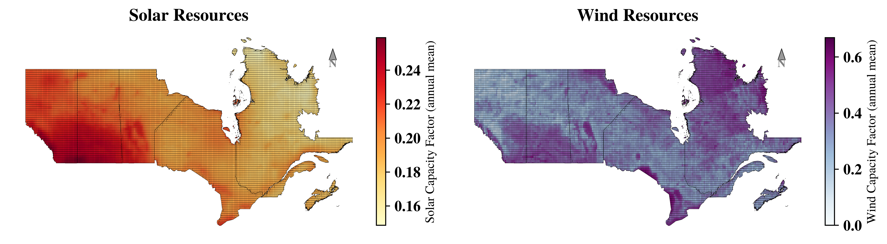

## Temporal profiles
Building on the spatial overview of average capacity factors, we next extract hourly generation profiles to analyse seasonal and diurnal performance dynamics at representative high-potential sites. Figure 7 illustrates the hourly resolution capacity factor (CF) profiles for selected solar and wind energy sites—Capital 1 (southern interior) and Peace River 1 (northern BC). For solar PV (top panel), the profiles reveal expected seasonal variation, with high CFs during summer months and near-zero generation in winter nights. The smoother shape and consistent daylight generation patterns underscore the predictability of solar profiles. In contrast, wind profiles (bottom panel) show higher variability throughout the year, with sporadic peaks and low average CFs. Notably, wind generation in Peace River exhibits distinct winter peaks, complementing the seasonal lull in solar output. These contrasting patterns demonstrate the value of geographic and technological diversification for renewable integration and grid stability. The hourly granularity provided by RESource supports more robust energy system modeling and planning scenarios.
 
 
<!-- <Figure 7: Hourly capacity factor (CF) profiles for representative solar and wind sites.> -->

While temporal profiles provide critical insight into seasonal and diurnal generation patterns, effective VRE planning also requires evaluating the spatial and regulatory context of candidate sites. The next section focuses on the geographic, infrastructural, and policy-driven parameters that shape site suitability, highlighting how RESource integrates these factors to inform spatial prioritization and investment readiness.

##	 Impact of grid accessibility
Following the assessment of temporal generation dynamics, we turn to a key economic driver of project feasibility: the spatial relationship between candidate sites and existing grid infrastructure. We map the centroid of each grid cell to the nearest substation for proximity analysis. RESource enables the site ranking sensitive to the proximity of existing infrastructure and provides a scalable approximation of grid connectivity costs. This helps prioritize sites where renewable generation can be integrated with minimal new infrastructure. shows the spatial distribution of grid substations and their proximity to each cell. Sites located closer to existing substations are inherently more attractive due to reduced transmission upgrade costs. In BC, where much of the terrain is remote or rugged, distance to infrastructure can outweigh resource quality in project feasibility. We also show the grid lines map (right side of Figure 8) to demonstrate that RESource can perform proximity analysis for both substations and the nearest connection points on explicitly rated lines. These spatial-economic filters feed directly into site scoring and prioritization workflows within RESource. 

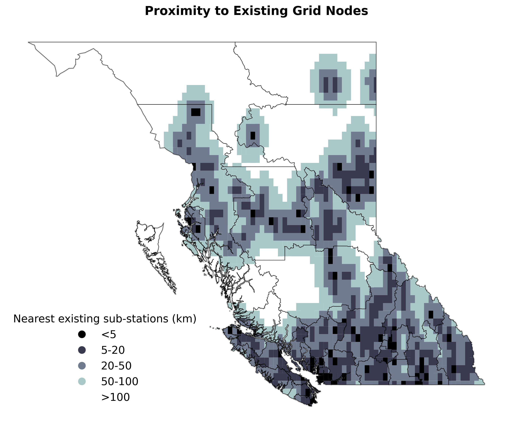
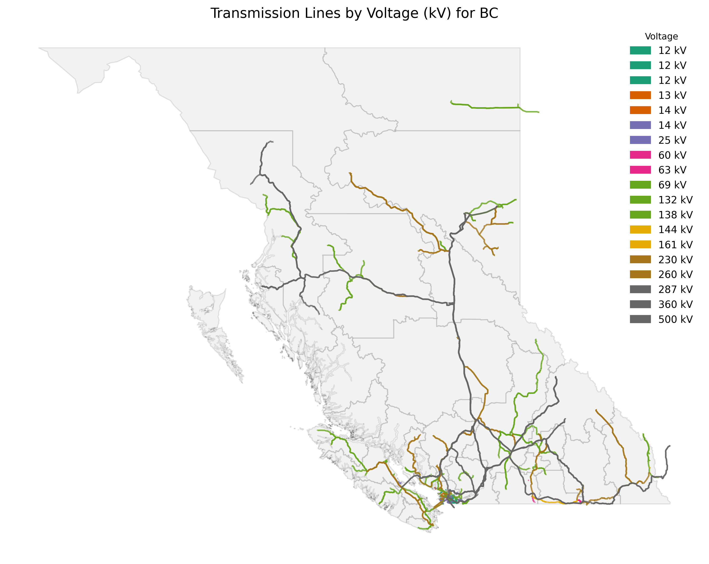

> Grid data shown above is sourced from Open-streetmap.


This case study in BC provides a practical example of how RESource integrates geospatial screening, weather-driven modeling, and infrastructure constraints to identify and evaluate VRE deployment opportunities. The following section presents the analytical outputs from this application, including estimated technical potential, site rankings, and the influence of policy constraints on site viability.

##	Insights from the BC case study
Applying the RESource to BC yields several important findings on the spatial and technical viability of VRE deployment. The analysis integrates VRE resource’s characterization, and infrastructure accessibility to derive ranked candidate sites for solar PV and onshore wind development.

### Renewable energy potential and site suitability
Our geospatial assessment identifies strong regional variation in VRE potential across BC:
•	Solar PV potential is highest in the southern interior, where terrain is flatter and solar irradiance is stronger and more consistent.
•	Wind energy resources are most promising along the north and west coasts, with additional pockets of viability in elevated interior plateaus.
Despite this theoretical potential, regulatory and physical constraints significantly reduce the pool of developable land. Approximately 64% of BC's landmass is excluded due to legal protections (e.g., parks), ecological concerns (e.g., wetlands), and terrain features (e.g., steep slop es).

Figure 9 presents two maps of BC, illustrating the theoretical capacity potential for solar and wind energy, where the map colors represent the score, with lighter shades indicating better economic feasibility and darker shades denoting expensive sites. The left map illustrates better feasible sites with lighter yellow areas in the southern and eastern interior regions suggesting higher potential and lower costs. The right map uses a green-to-blue gradient for wind site scoring, with lighter green areas along the coastal and northern regions indicating better economic viability. The distribution at the bottom of each map highlights the available potential across these score ranges. 

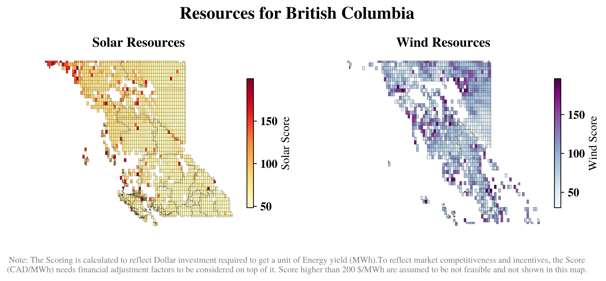

Building on the spatial insights from scores and potential capacity distributions, Figure 10 offers a complementary capacity-focused view that further clarifies how these site scores translate into aggregated development potential. Figure 10 shows a scatter plot illustrating the theoretical capacity potential, with bubble sizes representing clustered site’s capacity levels and colors reflecting solar and wind site scores. Lighter shades (orange for solar, blue for wind) indicate lower costs. The scoring, calculated to reflect the dollar investment per unit of energy yield (MWh), identifies clusters of larger bubbles as high-potential areas, with two boxed regions emphasizing concentrated zones of solar and wind capacity. Together, these outputs enable the identification of high-value locations where resource quality, land availability, and proximity to grid access align, supporting informed decision-making for VRE deployment.

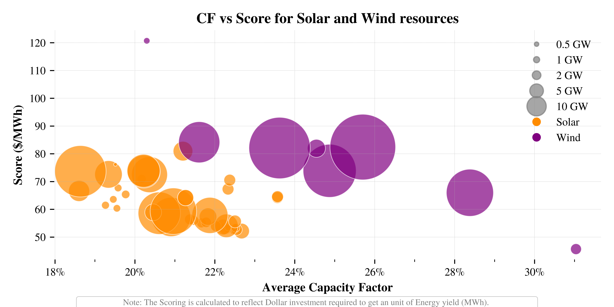

To translate spatial availability into investment prioritization, RESource ranks sites using a simplified levelized cost of energy (LCOE) metric that includes proximity to the transmission grid. We named this as score for the sites acknowledging that the market competitiveness and incentives are needed to be adjusted to reflect a competitive benchmark for the sites and that these are not directly translatable to the cost of energy from any given site. VRE sites owners and utilities might plug in their internal costs (Utility energy costs) to account project implementation and operation overheads. Such ranking is especially useful for planning under infrastructure or policy constraints.

### Ranking and prioritization
XXXX

---

*This case study demonstrates RESource's application to real-world renewable energy planning scenarios, integrating multiple data sources and constraints to provide actionable insights for VRE development in British Columbia.*
