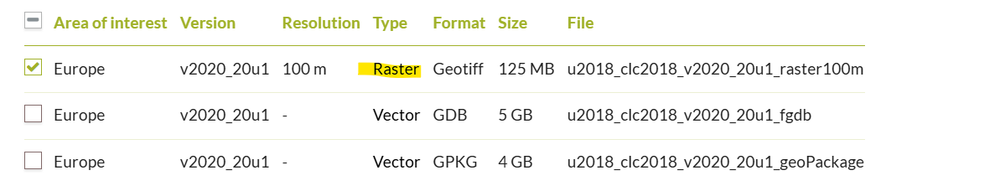

# Data Sources and Supply Chain

```{warning}
The data pipeline is under active development. This documentation will be updated as more regional studies are completed and new data sources are integrated.
```

## Overview

The RESource data supply chain integrates multiple global and regional data sources to support comprehensive renewable energy resource assessment and energy system modeling. The system prioritizes global data sources for consistency and scalability, with local government data sources used where global alternatives are unavailable or insufficient.

This documentation provides comprehensive information about each data source, including licensing requirements, access methods, data characteristics, and integration procedures. All use cases described are specific to renewable energy resource assessment and energy system analysis within the RESource framework.

### Data Source Categories

The RESource system integrates data across several key categories:

- **Power System Infrastructure**: Existing generation facilities, transmission networks, and grid connectivity data
- **Climate and Weather**: Meteorological data for renewable resource characterization and energy system modeling
- **Geospatial and Administrative**: Boundaries, land use constraints, and geographic reference data
- **Land Constraints**: Protected areas, terrain limitations, and development exclusions
- **Technology and Economics**: Cost data, performance parameters, and technology specifications
- **Demographics and Demand**: Population data and energy demand characteristics
  > currently not configured in the public version. Features under active development.

### Access Methods

Data sources employ various access mechanisms:
- **API Access**: Automated retrieval with authentication and caching
- **Direct Download**: HTTP-based file downloads with local storage
- **Manual Processing**: Interactive portals requiring user input
- **Third-party Services**: Integration through specialized libraries and tools

```{tip}
**Need Help? Encountered Issues?**

If you experience technical difficulties, workflow failures, or data pipeline breakdowns while using RESource:

1. **Check the Documentation**: Review the specific data source instructions and configuration examples
2. **GitHub Issues**: Report bugs, request features, or seek help at [RESource Issues](https://github.com/DeltaE/RESource/issues)
3. **Contact Developers**: Reach out to the development team for technical support and troubleshooting assistance
4. **Community Support**: Join discussions and share experiences with other RESource users

**Common Issues:**
- API authentication failures
- Network connectivity problems
- Configuration file errors
- Missing dependencies or environment setup
- Data format compatibility issues

Developer(s) actively monitors issues and provides support for data pipeline integration challenges.
```

## 1. Power System Infrastructure Data

### 1.1 CODERS (Canadian Open Data Exchange for Renewable Energy Systems)
> Exclusively for Canadian studies

```{tip}
RESource uses the [coders](https://github.com/DeltaE/RESource/blob/main/src/RESource/coders.py) module to access CODERS API data. Explore existing API endpoints and extend the module with custom methods to fit specific research needs.
```

- 🏷️ **Tag**: Local (Canada)
- 📄 **License**: Open data license with attribution required. Subjected to End-user License Agreement (EULA). Academic and research use permitted. Check if tables are marked as 'Proprietary' or 'restricted'.
    - Attribution: "Data source: CODERS (Canadian Open Data Exchange for Renewable Energy Systems), SESIT Lab"
- 🏛️ **Authority**: Sustainable Energy Systems Integration & Transitions (SESIT) Lab, University of Victoria, Canada
- 📊 **Data**: [CODERS dashboard](https://coders.cme-emh.ca/) and [CODERS API](http://api.sesit.ca)
    - 🔑 **Credentials**: Authorized users may retrieve [`coders_api.yaml`](https://github.com/eliasinul/modeling_inventory/blob/main/PyPSA/coders_api.yaml) and save it to `credentials/coders_api.yaml`. The source may require GitHub access; never commit or log its key. See the repository's [`credentials/README.md`](https://github.com/DeltaE/RESource/blob/main/credentials/README.md).
    - 🔍 **Resolution**: Individual facility-level data for power system infrastructure across Canada
- 📝 **Description**: CODERS provides comprehensive Canadian power system infrastructure data including power generation facilities (existing and planned), transmission substations, transmission lines, and regional power system characteristics. The database contains both current and historical power system data with geographic coordinates, capacity information, technology specifications, and operational parameters. Data is available at provincial and national scales, supporting detailed power system analysis and renewable energy integration studies.
- 🎯 **Use-case**:
    - **Power System Infrastructure Analysis**: Existing generator locations, capacities, and technology types for baseline power system modeling
    - **Transmission Network Mapping**: Substation locations and transmission line routes for grid connectivity analysis
    - **Regional Energy Assessment**: Provincial power system characteristics and capacity for regional energy planning
    - **Renewable Integration Studies**: Baseline power system data for evaluating renewable energy integration potential
    Available data tables include: generators, substations, transmission_lines, hydro_existing, wind_generators, forecasted_annual_demand
- ⚙️ **Supply_chain_mode**: API-based data retrieval with local caching
    - 📋 **Instruction**:
        1. **API Key Setup**: Create `coders_api.yaml` config file with the structure below:

        ```yaml
        api_keys:
          - <your_api_key>  # optional local note
        ```

        2. **File Storage**: Save the API config file at: `credentials/coders_api.yaml`

        3. **API Access**: Contact CODERS team to request API access keys for your research

        4. **Data Retrieval**: The system automatically:
           - Fetches data from CODERS API using authenticated requests
           - Caches data locally in pickle format for improved performance
           - Filters data by province/region as configured
           - Filters candidate connection substations using the configured CODERS
             node types and transmission-line endpoint topology
           - Converts tabular data to GeoDataFrames when geographic coordinates are available

        5. **Available Data Sources**:
           - `cef`: Canadian Energy Facts data tables
           - `coders`: Core power system infrastructure tables

        6. **Example Usage**: The system provides methods to:
           - List available tables: `show_list('coders')` or `show_list('cef')`
           - Retrieve national data: `get_table_canada('generators')`
           - Filter provincial data: `get_table_provincial('substations')`
           - Force data refresh: `force_update=True` parameter

```{important}
For Canadian resource connection-distance analysis, the active scenarios retain
CODERS substations whose `node_type` is `Generation` or `Terminal`
and whose `node_code` occurs as a starting or ending node in the CODERS
`transmission_lines` table. This follows the facility suffix and referential-closure
findings in the [CODERS transmission-lines data QA](https://github.com/DeltaE/PyPSA_BC/blob/dev/docs/QA/CODERS_transmission_lines_dataQA_2026-07-23.md):
GSS denotes generating-station switchyards and TSS major transmission substations.
`INT`, `IPT`, `SWS`, and `JCT` suffixes are excluded because they represent
cross-border ties, switching stations, or line taps rather than the candidate
plant-connection substations assumed here. Distribution substations are treated as
step-down/load nodes, while industrial substations are not assumed to be generally
available.

This is a screening assumption, not evidence that a retained node has spare
capacity, compatible voltage, an approved interconnection, available land, or a
constructible route. Those questions require project-level system and engineering
studies. Configure the rule with `CODERS.connection_filter`; disabling it restores
the unfiltered provincial CODERS substation table. See
[Canadian grid-connection candidates](assumptions.md)
for the full evidence table, implemented rule, and provenance.
```

## 2. Climate and Weather Data

### 2.1 ERA5 (ECMWF Reanalysis v5)
- 🏷️ **Tag**: Global
- 🏛️ **Authority**: Copernicus Climate Change Service (C3S), ECMWF, EU.
- 📄 **License**: free of charge, worldwide, non-exclusive, royalty free and perpetual.
    - Caution: have to mention the attribution regarding C3S.
    - [Check Article 4,5 of the license agreement](https://cds.climate.copernicus.eu/api/v2/terms/static/licence-to-use-copernicus-products.pdf)
- 📊 **Data**: [Complete ERA5 global atmospheric reanalysis](https://cds-beta.climate.copernicus.eu/datasets/reanalysis-era5-complete?tab=overview)
- 📝 **Description**: Solar influx, wind speed (vertical components at 100m), land elevation (heights) time-series data for weather years.
    - 🔍 **Resolution**: hourly time-series for .25 arc degree (~ 30km) grids.
- 🎯 **Use-case**:
    - A cutout is one of the basis for this work and associated calculations.
    - We are using [atlite](https://atlite.readthedocs.io/en/master/index.html) to create the cutout and also to download the [ERA5](https://www.ecmwf.int/en/forecasts/dataset/ecmwf-reanalysis-v5#:~:text=ERA5%20is%20the%20fifth%20generation,Service%20(C3S)%20at%20ECMWF.) data for the cutout. The cutout will be saved as a NetCDF (__.nc__) file. NetCDF is a file format often used for storing large scientific data sets that often involves time-series data, especially in the fields of climate and weather research. Please check this resource for [more about cutout preparation and customization](https://atlite.readthedocs.io/en/latest/examples/create_cutout.html).
    - In this analysis, we are downloading ERA5 data on-demand for a specified region e.g. __BC region cutout__ . But [atlite](https://atlite.readthedocs.io/en/latest/examples/create_cutout.html) does also work with other data sources e.g. [SARAH-2](https://atlite.readthedocs.io/en/latest/examples/create_cutout_SARAH.html) for high resolution solar dataset.
    - NREL has higher spatio-temporal dataset for renewable resources but does not cover complete global regions. Atlite currently does not support  NREL's [NSDRB for solar](https://nsrdb.nrel.gov) or [WRDB for wind](https://wrdb.nrel.gov/). Users can [follow this thread for updates](https://github.com/PyPSA/atlite/issues/213).
    - Atlite does not support ERA5 forecast data yet. Users can [follow this thread for updates](https://github.com/PyPSA/atlite/issues/184)

    Please go through [this documentation](https://atlite.readthedocs.io/en/master/examples/create_cutout.html) and example usage of cutout to learn further.

- ⚙️ **Supply_chain_mode**: Automated via cdsapi (current version is [cds-beta](https://cds-beta.climate.copernicus.eu/))

    ><U>Note</U>: From Sep 26, 2024 onwards the ERA5 dataset will only be supplied via cds-beta or ads-beta ([source](https://confluence.ecmwf.int/display/CKB/Please+read%3A+CDS+and+ADS+migrating+to+new+infrastructure%3A+Common+Data+Store+%28CDS%29+Engine))

    - Before the data can be downloaded from ERA5, it has to be processed by CDS servers, this might take a while depending on the volume of data requested. This only works if you have in before

    - CDS may temporarily reject a valid monthly request when the dataset queue is
      full. For every scenario, RESource keeps monthly requests sequential and
      retries only recognized temporary capacity-limit errors with capped
      exponential backoff. The package default is six total attempts, starting at
      60 seconds and capped at 900 seconds. Advanced users can override the policy
      under `cutout`:

      ```yaml
      cutout:
        cds_retry:
          max_attempts: 6
          base_delay_seconds: 60
          max_delay_seconds: 900
      ```

      Authentication failures and invalid requests are not retried. Do not start
      parallel RESource runs for the same CDS account while the service is limiting
      queued requests.

        - For linux users, please proceed as follows:

        - Steps to install the Copernicus Climate Data Store cdsapi package at your __local Linux/WSL__ (sourced from > [Registered and setup your CDS API key as described](https://cds-beta.climate.copernicus.eu/how-to-api))
        > step1: Setup the CDS API personal access token <br>
        > step2: Install the CDS API client. <br>
        >> Note: atlite currently supports cdsapi <=0.7.2

        Now your datapipeline to create the ERA5 Cutout is set.

## 3. Geospatial and Administrative Data

### 3.1 GADM (Global Administrative Areas)
- 🏷️ **Tag**: Global
    - This data could be sourced locally as well e.g for Canada from [Canadian open-dataset](https://open.canada.ca/data/en/dataset/306e5004-534b-4110-9feb-58e3a5c3fd97)
    - Other global data sources :
        - OpenstreetMap via [pyrosm](https://pyrosm.readthedocs.io/en/latest/basics.html#read-boundaries) library.
        - World Administrative Boundaries - Countries and Territories by opendatasoft (https://public.opendatasoft.com/explore/dataset/world-administrative-boundaries/export)

- 📄 **License**: [freely available for academic use and other non-commercial use](https://gadm.org/license.html)
- 🏛️ **Authority**: University of Berkeley, Museum of Vertebrate Zoology and the International Rice Research Institute (2012)
- 📊 **Data**: [Download GADM data (v4.1 | 16 July 2022 )](https://gadm.org/download_country.html)
- 📝 **Description**: [GADM](https://gadm.org/), the Database of Global Administrative Areas, is a high-resolution database of country administrative areas, with a goal of "all countries, at all levels, at any time period.
- 🎯 **Use-case**: This boundary has been processed for admin level 2 (i.e. sub-provincial) to extract geospatial boundaries of the Regional Districts (RD) e.g. 28 RDs inside BC, Canada. This boundary is primarily used for spatial-grid cell/point mapping, regional overlay visuals, clipping point of interests in regional level while clustering.
- ⚙️ **Supply_chain_mode**: Automated via [pygadm](https://pypi.org/project/pygadm) library [supports GADM data V4.1]
    - Country boundaries are fetched in memory. New runs do not create or retain a
      `data/downloaded_data/GADM` cache; only the selected region GeoJSON is saved
      under the configured processed-data directory. Existing country cache files
      remain supported for backward compatibility.

### 3.2 CPCAD (Canadian Protected and Conserved Areas Database)

> Explicitly for Canadian Studies
- 🏷️ **Tag**: Local
    - GAEZ also has similar global data under Land Resources (LR) theme, raster data with 7 classes. We are using this data as a mandatory filter in the process. But the local (pan-Canadian) data has more detailed local government and indigenous protected areas' data. The user can control the classes of exclusion and also can use buffer around exclusion for both case.
- 📄 **License**: Data obtained through this application is distributed under the [Canadian Open Government License](https://www2.gov.bc.ca/gov/content/data/policy-standards/open-data/open-government-licence-bc).
    - In-short :  worldwide, royalty-free, perpetual, non-exclusive licence to Copy, modify, publish, translate, adapt, distribute or otherwise use the Information in any medium, mode or format for any lawful purpose
- 🏛️ **Authority**: Environment and Climate Change Canada (ECCC)
- 📊 **Data**: [Canadian Protected and Conserved Areas Database (CPCAD) | 2023-12-31](https://catalogue.ec.gc.ca/geonetwork/oilsands/api/records/6c343726-1e92-451a-876a-76e17d398a1c)
    - downloadble_source_url: https://data-donnees.az.ec.gc.ca/api/file?path=%2Fspecies%2Fprotectrestore%2Fcanadian-protected-conserved-areas-database%2FDatabases%2FProtectedConservedArea_2022.gdb.zip
    - 🔍 **Resolution**: Spatial boundaries vector data
- 📝 **Description**: CPCAD is the authoritative source of data on protected and conserved areas in Canada. The database consists of the most up-to-date spatial and attribute data on marine and terrestrial protected areas in all governance categories recognized by the International Union for Conservation of Nature (IUCN), as well as other effective area-based conservation measures (OECMs, or conserved areas) across the country. Indigenous Protected and Conserved Areas (IPCAs) are also included if they are recognized as protected or conserved areas. CPCAD adheres to national reporting standards and is available to the public.
- 🎯 **Use-case**: These specific areas (raster cells/vectors) are excluded in analysis for site considerations. The modeller can also consider buffer around exclusion areas.
- ⚙️ **Supply_chain_mode**: Automated via specific url download. Has dependency on [source_url](https://data-donnees.az.ec.gc.ca/api/file?path=%2Fspecies%2Fprotectrestore%2Fcanadian-protected-conserved-areas-database%2FDatabases%2FProtectedConservedArea_2022.gdb.zip).

## 4. Land Constraint and Suitability Data

### 4.1 GAEZ (Global Agro-Ecological Zones)
> For global land constraint analysis
- 🏷️ **Tag**: Global
- 📄 **License**: The datasets are available under open access policy. Attribution required: "Source: FAO-GAEZ v4.0, 2021".
    - [FAO Open Data License](http://www.fao.org/3/ca7570en/ca7570en.pdf): Free use for any purpose, with attribution.
- 🏛️ **Authority**: Food and Agriculture Organization of the United Nations (FAO) and International Institute for Applied Systems Analysis (IIASA)
- 📊 **Data**: [GAEZ v4.0 Land Resources (LR) Dataset](https://gaez.fao.org/pages/data-viewer)
    - 🔍 **Resolution**: 5 arc-minute (~10km at equator) and 30 arc-second (~1km at equator) grid resolution, global coverage
- 📝 **Description**: Global Agro-Ecological Zones (GAEZ) is a comprehensive global land resources assessment that provides spatial data on agricultural potential, land constraints, and ecological zones. GAEZ v4.0 includes multiple thematic layers such as terrain slope, land cover/use, exclusion areas (protected areas and biodiversity hotspots), and agro-climatic resources. The dataset uses consistent methodologies for global coverage and provides essential input for land suitability analysis.
- 🎯 **Use-case**: Used for land constraint analysis in renewable energy siting. The tool processes multiple GAEZ layers including:
    - **Exclusion Areas** (`exclusion_2017.tif`): Protected areas and biodiversity zones to exclude from development
    - **Terrain Slope** (`slpmed05.tif`): Median slope classes for accessibility and installation feasibility analysis
    - **Land Cover** (`faocmb_2010.tif`): Dominant land cover/use types for compatibility assessment
    Different constraint classes are applied for solar vs wind development based on terrain and land use suitability requirements.
- ⚙️ **Supply_chain_mode**: Automated download and processing via ZIP archive
    - 📋 **Instruction**:
        1. The system first reuses any existing region-prefixed clipped outputs
        2. For missing outputs, it downloads `LR.zip` to an operating-system temporary directory
        3. It extracts only the configured source layers into that temporary workspace
        4. It clips those layers to regional boundaries and retains only the clipped GeoTIFFs
        5. The archive and global extracted rasters are automatically removed when processing ends
           - **Example** configuration structure from `config/WB6_baseline.yaml`:

           ```yaml
           GAEZ:
             root: 'data/downloaded_data/GAEZ'
             source: 'https://s3.eu-west-1.amazonaws.com/data.gaezdev.aws.fao.org/LR.zip'
             zip_file: 'LR.zip'
             # Relative to GAEZ.root; resolves to
             # Regional derivatives are written below data/processed_data/GAEZ.
             processed_root: data/processed_data/GAEZ
             raster_types:
             # GAEZ v4 'exclusion' layer of protected areas and biodiversity values
             - name: 'exclusion_areas'
               raster: "exclusion_2017.tif"
               zip_extract_direct: 'LR/excl'
               color_map: 'OrRd'
               stepwise_plot_title: "Excluding Global Exclusion Areas"
               class_exclusion:
                 solar: [ 2, 3, 4, 5, 6, 7 ]  # Exclude protected areas, biodiversity zones, water
                 wind: [ 2, 3, 4, 5, 6, 7 ]

             # GAEZ v4 Median slope class from SRTM data
             - name: 'terrain_resources'
               raster: "slpmed05.tif"
               zip_extract_direct: 'LR/ter'
               color_map: 'terrain'
               stepwise_plot_title: "Excluding Terrain Slope"
               class_exclusion:
                 solar: [ 7, 8, 9 ]  # Exclude high slopes (>30%) and water
                 wind: [ 7, 8, 9 ]
           ```

### 4.2 CORINE Land Cover
> Explicitly recommended for EUROPEAN studies.

- 🏷️ **Tag**: European
- 📄 **License**: Data obtained through this application is distributed under the [Copernicus Open Access Hub License](https://scihub.copernicus.eu/twiki/do/view/SciHubWebPortal/TermsConditions). Free, full, and open access worldwide, royalty-free, non-exclusive license.
- 🏛️ **Authority**: European Environment Agency (EEA), Copernicus Land Monitoring Service
- 📊 **Data**: [CORINE Land Cover 2018](https://land.copernicus.eu/en/products/corine-land-cover/clc2018)
    - 🔍 **Resolution**: 100m raster resolution, 44 land cover classes
- 📝 **Description**: CORINE Land Cover (CLC) 2018 is a European land cover and land use mapping product based on the interpretation of satellite images. It provides consistent and thematically detailed information on land cover and land cover changes across Europe. The CLC uses a Minimum Mapping Unit (MMU) of 25 hectares for areal phenomena and a minimum width of 100 metres for linear phenomena. CLC 2018 is the most recent version, produced with 2018 as reference year.
- 🎯 **Use-case**: Used for land suitability analysis to identify suitable areas for renewable energy installations (solar and wind). The tool excludes unsuitable land cover classes and includes only appropriate land types for energy development. Different land cover classes are filtered for solar vs wind applications based on terrain and land use compatibility.
- ⚙️ **Supply_chain_mode**: Manual registration and download via API access
    - 📋 **Instruction**:
    -
        1. Go to [CLC download](https://land.copernicus.eu/en/products/corine-land-cover/clc2018#download)
        2. Register to their portal for API access
        3. Use the raster option to get the download URL

        

        4. Download the raster file package (comes as a zip file) and extract the raster file (.tiff) from the zip.
        5. Save the raster file (.tiff) inside 'data/downloaded_data/CORINE'
        6. Update the `raster` key in your configuration file (e.g., `config/WB6_baseline.yaml`) with the downloaded raster file (.tiff) name.

           - __Example__ configuration structure from `config/WB6_baseline.yaml`:
           ```yaml
           CORINE:
           root: 'data/downloaded_data/CORINE'
           raster_types:
           # list of dictionaries
           # CORINE Land Cover (CLC) 2018 raster data (100m resolution, 44 classes)
           - name: 'CORINE_land_cover'
               readme: 'https://eea.github.io/clms-api-docs/download.html#download-prepackaged-files'
               raster: 'U2018_CLC2018_V2020_20u1.tif'
               color_map: 'tab20'
               stepwise_plot_title: "Excluding not-Suitable CORINE Landcovers"
               class_inclusion:
               solar: [ 7, 8, 9, 31, 32, 38 ]
               wind: [ 7, 8, 12, 23, 18, 26, 27, 28, 29, 31, 32, 33 ]
           ```
```{tip}
You can also skip this configuration setup and download the file or use your customized area raster file. __If you already have a local raster__ (.tiff) file for your analysis, please drop the file at __'data/downloaded_data/CORINE'__ directory and update the 'raster' key with your local file name.

The class inclusion layers should match the layers available at your raster.
```

### 4.3 OSM (OpenStreetMap) Infrastructure Constraints
> For infrastructure and constraint mapping

- 🏷️ **Tag**: Global
- 📄 **License**: Open Database License (ODbL)
    - Attribution: "© OpenStreetMap contributors"
- 🏛️ **Authority**: OpenStreetMap Foundation and global contributor community
- 📊 **Data**: [OpenStreetMap](https://www.openstreetmap.org/)
    - 🔍 **Resolution**: Vector data with individual feature precision
- 📝 **Description**: OpenStreetMap provides comprehensive, crowd-sourced geospatial data including infrastructure, land use, and constraint features. For renewable energy analysis, OSM data includes power infrastructure (transmission lines, substations, power plants), transportation networks (roads, railways, airports), and land use constraints. The data is continuously updated by a global community of contributors and provides detailed, current information on infrastructure and constraints.
- 🎯 **Use-case**:
    - **Infrastructure constraint mapping**: Airport buffer zones, power line corridors, transportation exclusions
    - **Grid connection analysis**: Existing substation and transmission line locations
    - **Land use exclusions**: Built-up areas, protected zones, infrastructure setbacks
    - **Buffer zone creation**: Automated buffer generation around constraint features
- ⚙️ **Supply_chain_mode**: API-based query using OSMnx library
    - 📋 **Instruction**:
        1. System queries OSM Overpass API for specific feature tags
        2. Downloads vector data as GeoDataFrames
        3. Caches data locally as GeoJSON files
        4. Applies configured buffer distances for constraint analysis
        5. **Example** configuration from `config/WB6_baseline.yaml`:
        ```yaml
        OSM_data:
          root: 'data/downloaded_data/OSM'
          data_keys:
            aeroway:
              tags: [ 'aerodrome', 'runway', 'taxiway', 'helipad', 'apron', 'gate' ]
            power:
              tags: [ 'line', 'cable', 'substation', 'tower', 'generator', 'plant' ]
        ```
    __Note__:
    RESource's [gwa module](https://github.com/DeltaE/RESource/blob/main/RES/gwa.py) handles the 'GWA_country_code' and replaces them with appropriate codes as configured under 'region mapping' key. __Example__ of how GWA_country_code is configured :
    ```yaml
    region_mapping:
    'AB':
        name: Alberta
        land_area_km2: 642,317
        percentage_national_land_area: 7.1%
        timezone_convert: Etc/GMT-7
        sub_region_mapping: {}
        GWA_country_code: CAN
        CRS_meters: EPSG:3577

    'BC':
        name: British Columbia
        land_area_km2: 925,186
        percentage_national_land_area: 10.4%
        timezone_convert: Etc/GMT+7
        sub_region_mapping: {}
        GWA_country_code: CAN
        CRS_meters: EPSG:3005
    ```

## 5. Renewable Energy Resource Data

### 5.1 GWA (Global Wind Atlas)

RESource stages each country-scale GWA raster in an operating-system temporary
directory, clips it to the configured regional boundary, and retains only the
region-prefixed GeoTIFF under `data/downloaded_data/GWA`. Temporary country files
are removed automatically, while existing regional clips are reused.
> For high-resolution wind resource analysis

- 🏷️ **Tag**: Global
- 📄 **License**: Creative Commons Attribution 4.0 International License (CC BY 4.0)
    - Attribution: "Global Wind Atlas 3.0, a free, web-based application developed, owned and operated by the Technical University of Denmark (DTU). The Global Wind Atlas 3.0 is released in partnership with the World Bank Group, utilizing data provided by Vortex, using funding provided by the Energy Sector Management Assistance Program (ESMAP)."
- 🏛️ **Authority**: Technical University of Denmark (DTU) in partnership with World Bank Group and Vortex
- 📊 **Data**: [Global Wind Atlas](https://globalwindatlas.info/)
    - 🔍 **Resolution**: 250m spatial resolution, annual and seasonal statistics
- 📝 **Description**: The Global Wind Atlas provides high-resolution wind resource data including wind speed, wind power density, and wind power class information. It offers detailed wind statistics at hub heights from 10m to 200m above ground level, capacity factors for different IEC wind turbine classes, and extreme wind conditions. The atlas combines mesoscale modeling with high-resolution terrain and roughness data to provide accurate wind resource estimates for wind energy development.
- 🎯 **Use-case**:
    - **High-resolution wind resource mapping**: Detailed wind speed and power density analysis at multiple hub heights
    - **Wind turbine siting**: Capacity factor estimates for different IEC turbine classes (IEC1, IEC2, IEC3)
    - **Resource validation**: Comparison with ERA5 data for resource assessment validation
    - **Site-specific analysis**: Fine-scale wind resource characterization for detailed feasibility studies
- ⚙️ **Supply_chain_mode**: Automated download of parquet/CSV files
    - 📋 **Instruction**:
        1. System downloads ATB parquet files from NREL data repository
        2. Filters data by technology type (UtilityPV, LandbasedWind, etc.)
        3. Extracts cost parameters and performance metrics
        4. Exports processed cost data for LCOE calculations
        5. **Example** configuration from `config/WB6_baseline.yaml`:
        ```yaml
        NREL:
          ATB:
            root: 'data/downloaded_data/NREL/ATB'
            source:
              parquet: https://oedi-data-lake.s3.amazonaws.com/ATB/electricity/parquet/2024/v3.0.0/ATBe.parquet
            cost_params:
              capex: 'OCC' # Overnight Capital Cost
              fom: 'Fixed O&M'
        ```

### 5.2 NREL ATB (Annual Technology Baseline)
> For renewable energy technology cost and performance data

- 🏷️ **Tag**: Global
- 📄 **License**: Creative Commons Attribution 4.0 International License (CC BY 4.0)
    - Attribution: "National Renewable Energy Laboratory (NREL)"
- 🏛️ **Authority**: National Renewable Energy Laboratory (NREL), U.S. Department of Energy
- 📊 **Data**: [NREL Annual Technology Baseline](https://atb.nrel.gov/)
    - 🔍 **Resolution**: Technology-specific cost and performance data with annual projections
- 📝 **Description**: The Annual Technology Baseline (ATB) provides current and future cost and performance estimates for electricity generation, storage, and transportation technologies. ATB provides a consistent set of technology cost and performance data for energy analysis and is updated annually with the latest projections for renewable energy technologies including solar PV, wind, storage, and other generation technologies.
- 🎯 **Use-case**:
    - **LCOE calculations**: Technology-specific capital and operational cost data for economic analysis
    - **Technology comparison**: Standardized cost and performance metrics across different technologies
    - **Future projections**: Cost reduction scenarios and technology improvement trajectories
    - **Investment analysis**: Financial modeling inputs for renewable energy projects
- ⚙️ **Supply_chain_mode**: Automated download of parquet/CSV files
    - 📋 **Instruction**:
        1. System downloads ATB parquet files from NREL data repository
        2. Filters data by technology type (UtilityPV, LandbasedWind, etc.)
        3. Extracts cost parameters and performance metrics
        4. Exports processed cost data for LCOE calculations
        5. **Example** configuration from `config/WB6_baseline.yaml`:
        ```yaml
        NREL:
          ATB:
            root: 'data/downloaded_data/NREL/ATB'
            source:
              parquet: https://oedi-data-lake.s3.amazonaws.com/ATB/electricity/parquet/2024/v3.0.0/ATBe.parquet
            cost_params:
              capex: 'OCC' # Overnight Capital Cost
              fom: 'Fixed O&M'
        ```

### 5.3 OEDB (Open Energy Database) Wind Turbine Library
> For wind turbine specifications and performance data

- 🏷️ **Tag**: Global
- 📄 **License**: Open Database License (ODbL) and various open licenses
    - Attribution: "Open Energy Platform (OEP), Reiner Lemoine Institut"
- 🏛️ **Authority**: Open Energy Platform, Reiner Lemoine Institut, Germany
- 📊 **Data**: [Open Energy Database Wind Turbine Library](https://openenergy-platform.org/dataedit/view/supply/wind_turbine_library)
    - 🔍 **Resolution**: Individual turbine model specifications
- 📝 **Description**: The Open Energy Database provides detailed technical specifications for wind turbine models including power curves, hub heights, rotor diameters, and performance characteristics. The wind turbine library contains manufacturer data for hundreds of turbine models with standardized technical parameters. This data supports detailed wind energy analysis by providing realistic turbine specifications for capacity factor calculations and energy yield modeling.
- 🎯 **Use-case**:
    - **Turbine performance modeling**: Power curves and capacity factor calculations
    - **Technology selection**: Comparison of turbine specifications for site-specific analysis
    - **Yield optimization**: Hub height and rotor diameter optimization for wind resources
    - **Economic analysis**: Turbine-specific cost and performance parameters
- ⚙️ **Supply_chain_mode**: API access and manual configuration files
    - Instruction:
        1. System accesses OEDB API for turbine specifications
        2. Downloads YAML configuration files for specific turbine models
        3. Integrates turbine power curves with wind resource data
        4. **Example** configuration from `config/WB6_baseline.yaml`:
        ```yaml
        wind:
          turbines:
            OEDB:
              source: 'https://openenergy-platform.org/api/v0/schema/supply/tables/wind_turbine_library/rows'
              models:
                1:
                  name: 'GE2.75_120'
                  ID: 116
                  P: 2.75 # Nominal Power (MW)
                  config: 'data/downloaded_data/OEDB/3.2M114_NES.yaml'
        ```

## 6. Demographics and Demand Data

### 6.1 CEEI (Community Energy and Emissions Inventory)
  > Not required for the current public version. Required for features under active development.

- 🏷️ **Tag**: Local
- 📄 **License**: Data obtained through this application is distributed under the [Canadian Open Government License](https://www2.gov.bc.ca/gov/content/data/policy-standards/open-data/open-government-licence-bc).
- 🏛️ **Authority**: [Community Energy and Emissions Inventory(CEEI)]https://www2.gov.bc.ca/gov/content/environment/climate-change/data/ceei
- 📊 **Data**: [CEEI data up to 2021](https://www2.gov.bc.ca/gov/content/environment/climate-change/data/ceei/current-data)
    - 🔍 **Resolution**: Annual total for Regional Districts, for different sectors and different end-use demands.
- 📝 **Description**: The Community Energy and Emissions Inventory (CEEI) provides community-level greenhouse gas (GHG) emissions and energy consumption estimates for communities across BC. The data covers the buildings, municipal solid waste, and on-road transportation sectors for 161 municipalities, 28 regional districts, and 1 region (Stikine).
    - Buildings :The data is provided by utility companies and includes the amount of electricity and natural gas used by residential, commercial and some industrial buildings.
    - Transportation : Community-level data on greenhouse gas emissions from on-road transportation.
    - Waste : Estimates of community greenhouse gas emissions based on historic annual tonnes of waste disposed at regional district landfills.
    > More about [data methods](https://www2.gov.bc.ca/gov/content/environment/climate-change/data/ceei/methodology) and [inputs](https://www2.gov.bc.ca/gov/content/environment/climate-change/data/ceei/current-data)
- 🎯 **Use-case**: Used for load-center estimations on regional district level. Further used for Battery Energy Storage (BESS) size and required discharge hour estimation.
- ⚙️ **Supply_chain_mode**: Automated via specific url download. Check config file for specific url dependencies.

### 6.2 Population Data
> For Canadian studies (under development)

- 🏷️ **Tag**: Local
- 🏛️ **Authority**: Statistics Canada
- 📄 **License**: Data obtained through this application is distributed under the [Canadian Open Government License](https://www2.gov.bc.ca/gov/content/data/policy-standards/open-data/open-government-licence-bc).
    - In-short: worldwide, royalty-free, perpetual, non-exclusive licence to Copy, modify, publish, translate, adapt, distribute or otherwise use the Information in any medium, mode or format for any lawful purpose
- 📊 **Data**: [Population projection 2021-2046](https://bcstats.shinyapps.io/popApp)
    - 🔍 **Resolution**: Annual population for regional districts (sub-provincial).
- 📝 **Description**: Historical data up to 2023 and projection for 2024-2046.
- 🎯 **Use-case**: To mimic the load-centers in Canada at sub-provincial level (regional districts of province)
- ⚙️ **Supply_chain_mode**: Manual Download from the portal
    - 📋 **Instruction**: Manually download from the portal with mentioned steps given in [data_sources.yml](https://github.com/DeltaE/Linking_tool/blob/main/config/data_source.yml)

### 6.3 WorldPop
> For population density and demographic analysis (under development)

- 🏷️ **Tag**: Global
- 📄 **License**: Creative Commons Attribution 4.0 International License (CC BY 4.0)
    - Attribution: "WorldPop (www.worldpop.org - School of Geography and Environmental Science, University of Southampton)"
- 🏛️ **Authority**: WorldPop Research Group, University of Southampton
- 📊 **Data**: [WorldPop Global Population Data](https://www.worldpop.org/)
    - 🔍 **Resolution**: 1km × 1km grid cells, annual estimates
- 📝 **Description**: WorldPop provides high-resolution, contemporary data on human population distributions. The dataset includes population count, population density, and demographic breakdowns at fine spatial scales. Data is produced using census data, satellite imagery, and geospatial datasets through machine learning approaches to create gridded population estimates that are more accurate than traditional administrative unit-based data.
- 🎯 **Use-case**:
    - **Load center identification**: Population-weighted demand center estimation for energy planning
    - **Grid connection prioritization**: Population density analysis for transmission planning
    - **Environmental impact assessment**: Population exposure analysis for renewable energy projects
    - **Demand forecasting**: Population-based electricity demand projections
- ⚙️ **Supply_chain_mode**: Direct download from WorldPop data portal
    - 📋 **Instruction**:
        1. System downloads ASCII XYZ or GeoJSON files from WorldPop servers
        2. Processes population count and density layers
        3. Clips data to regional boundaries
        4. **Example** configuration from `config/WB6_baseline.yaml`:
        ```yaml
        WorldPop:
          root: 'data/downloaded_data/WorldPop'
          source:
            population_density_CAN: 'https://data.worldpop.org/GIS/Population_Density/Global_2000_2020_1km_UNadj/2020/CAN/can_pd_2020_1km_UNadj_ASCII_XYZ.zip'
            population_count_CAN: 'https://data.worldpop.org/GIS/Population/Global_2000_2020_1km_UNadj/2020/CAN/can_ppp_2020_1km_UNadj_ASCII_XYZ.zip'
        ```

---
## 7. Legends and Color Coding Standardization

The RESource system uses standardized legend files and color coding schemes to ensure consistent visualization across different raster datasets. These small lookup tables are package assets under `src/RESource/assets/legends/`; they are tracked in Git and included when users install `deltae-resource`.

### 7.1 Available Legend Files
> These files support post-processing visualization and are available through Python package resources. They are not generated or downloaded workflow data.

The following standardized legend CSV files are distributed with RESource:

### 1. **CLC_2018_legend.csv**
- **Purpose**: CORINE Land Cover 2018 class definitions and colors
- **Structure**: 44 land cover classes with descriptions and hex color codes
- **Example classes**:
  - Class 1: Continuous urban fabric (#e6004d)
  - Class 12: Non-irrigated arable land (#ffffa8)
  - Class 44: Salt marshes (#cccccc)

### 2. **gaez_exclusion_legend.csv**
- **Purpose**: GAEZ exclusion areas (protected areas and biodiversity zones)
- **Structure**: 7 exclusion classes with conservation status descriptions
- **Example classes**:
  - Class 1: no exclusion (#b2df8a)
  - Class 2: IUCN category in WDPA (#fcae91)
  - Class 7: water (#66c2a5)

### 3. **gaez_terrains_legend.csv**
- **Purpose**: GAEZ terrain slope classifications
- **Structure**: 9 slope classes from flat to high slope plus water
- **Example classes**:
  - Class 1: flat (0-0.5%) (#edf8e9)
  - Class 8: high slope (>45%) (#a0092cff)
  - Class 9: Water (#66c2a5)

### 4. **gaez_landcover_legend.csv**
- **Purpose**: GAEZ land cover/use classifications
- **Structure**: 11 dominant land cover types
- **Example classes**:
  - Class 2: cropland (#62e660ff)
  - Class 4: forest/tree covered areas (#0a6304ff)
  - Class 11: water bodies (#6a3d9a)

### 5. **CPCAD_legends.csv**
- **Purpose**: Canadian Protected and Conserved Areas Database classifications
- **Structure**: IUCN categories with conservation descriptions
- **Example classes**:
  - National Park (#06c854ff)
  - Wilderness Area (#1f7c02ff)
  - OECM areas (#9467bd)

### 7.2 Legend File Structure

All legend CSV files follow a consistent structure:

- `class`: Integer class value matching raster pixel values
- `description`: Human-readable description of the class
- `color`: Hex color code for visualization (format: #RRGGBB or #RRGGBBAA with alpha)

## Usage and Configuration

### Color Map Integration

The system uses these legend files in two ways:

1. **Matplotlib colormaps** (specified in config files via `color_map` parameter):
   ```yaml
   raster_types:
   - name: 'exclusion_areas'
     color_map: 'OrRd'  # Standard matplotlib colormap
   ```

2. **Custom legend-based colormaps** (using CSV legend files):
   ```python
   # In visualization functions; works from source and after pip installation
   from RESource.assets import legend_file

   legend_df = pd.read_csv(legend_file('gaez_exclusion_legend.csv'))
   custom_cmap = ListedColormap(legend_df['color'].tolist())
   ```

### Data Version Harmonization

**⚠️ IMPORTANT**: Legend files must be synchronized with the actual raster data versions to avoid visualization errors.

**Requirements:**
- Legend class values must exactly match raster pixel values
- Missing classes in legend files will cause visualization failures
- Extra classes in legend files are acceptable (filtered automatically)
- Color codes must be valid hex format

**Version Control:**
- When updating raster datasets, verify class values match legend files
- Update legend descriptions if class definitions change
- Maintain consistent color schemes across related datasets

### Customizing Colors

Users can modify legend colors by editing the CSV files:

1. **Edit legend file** (e.g., `data/CLC_2018_legend.csv`):
   ```text
   class,description,color
   1,Continuous urban fabric,#your_new_color
   2,Discontinuous urban fabric,#another_color
   ```

2. **Validate hex colors**: Ensure colors follow hex format (#RRGGBB or #RRGGBBAA)

3. **Test visualization**: Run visualization functions to verify color changes

4. **Maintain consistency**: Keep related datasets using compatible color schemes

### Error Prevention

**Common issues and solutions:**
- **Missing classes**: Add missing class entries to legend files
- **Invalid hex codes**: Verify color format (#RRGGBB or #RRGGBBAA)
- **Class mismatch**: Ensure raster values exactly match legend class column
- **Encoding issues**: Save CSV files with UTF-8 encoding

**Best practices:**
- Backup original legend files before modifications
- Use colorbrewer-compatible color schemes for accessibility
- Test visualizations after legend changes
- Document color scheme rationale for future reference

---
<!--
---
## Information Template
- 🏷️ **Tag**:
- 📄 **License**:
- 🏛️ **Authority**:
- 📊 **Data**: [title](Url)
    - 🔍 **Resolution**:
- 📝 **Description**:
- 🎯 **Use-case**:
- ⚙️ **Supply_chain_mode**:
    - 📋 **Instruction**:  -->
